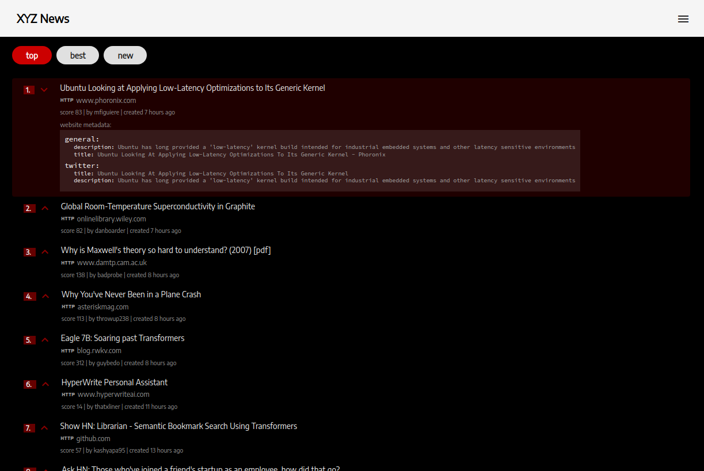

## XYZ News App

#### - [ Developed by Eaglex ](http://eaglex.net)

#### Overview

Angular MVC application, listing of `opensource` [hacker-news api](https://github.com/HackerNews/API), upgraded to own Rest/api for optimized requests. With 3 paginated news categories, each selected listing fetches metadata from external url. Design approach taken from `https://news.ycombinator.com/best`.

Application features:

-   Angular/cli project and architecture
-   proxy support for development
-   Lazy loading feature
-   Mobile friendly
-   Multi project support
-   Services, Libs, utils and Components modular separation
-   State management for caching http requests
-   RX.js implementation on all http requests
-   Configurable theme with access to bootstrap and material variables
-   Documented and linted code
-   Production ready

<br>

### <span style="color:red">Latest updates</span>

<i>Project demo is now available on github pages: </i>
**[ >> bucket-list <<](https://eag1ex.github.io/xyz-news-app/)**


<br>
<br>

#### Live Demo

```sh
## OLD, INACTIVE
# Hosted on heroku node.js server (_server has timeout limit_, free dyno):
# https://immense-ocean-43660.herokuapp.com/xyz
```

#### Install

The Application was build on `node@~12.0.0` and `npm@~6.9.0`, {engineStrict} is set, not sure if it will run below those versions.

```sh
$/ npm install
```

#### Start

-   To run local version, first you need to install and start [xyz-news-server](https://bitbucket.org/eag1ex/xyz-news-server), so it can access the api via ./proxy setting.

-   Open browser in `http://localhost:4444`

```sh
$/ npm start # initial start will compile angular
$/ npm run build:prod # build production version to ./dist
```

#### Stack

Typescript, MVC, Angular 11/ CLI, Bootstrap, angular.material, RX.js, SCSS, state/management, Rest/api, [ x-utils-es ](https://www.npmjs.com/package/x-utils-es)

#### Server app

For server app visit: `https://bitbucket.org/eag1ex/xyz-news-server`

#### Hierarchy

Application structure

-   Projects:

    -   xyz

-   Libs:

    -   xyz-pages
        -   story: `(our lazy loaded application)`
        -   error: on error or invalid routes
    -   interfaces
    -   material
    -   utils
    -   theme:
        -   scss: `(styles base) libs\theme\scss\styles.scss`
        -   fonts
        -   assets
    -   services
        -   RouterEventService
    -   http: our rx.js api with state/caching
    -   xyz-components: all available component sections live here
    -   data: all `(most)` static data lives here

-   proxy: `./api` requests in development are routed via proxy setting

#### Essential VSC plugins

-   Angular Essentials (Version 11) `johnpapa.angular-essentials`
-   Angular Language Service `angular.ng-template`
-   Angular Schematics `cyrilletuzi.angular-schematics`
-   Angular template formatter `stringham.angular-template-formatter`
-   Auto Import `steoates.autoimport`
-   Comment Anchors `exodiusstudios.comment-anchors`
-   Prettier - Code formatter `esbenp.prettier-vscode`
-   TSLint `ms-vscode.vscode-typescript-tslint-plugin`

### Notes

-   `"@angular/material": "=11.2.0", "bootstrap": "=4.6.0"` < need to stay in those versions for compatibility
-   No tests provided at the moment

### Angular start guide info

refer to > `./angular.readme.md`

##### LICENSE

-   LICENSE: CC-BY-NC-ND
-   SOURCE: _(https://creativecommons.org/licenses/by-nc-nd/4.0/)_

##### Thank you
